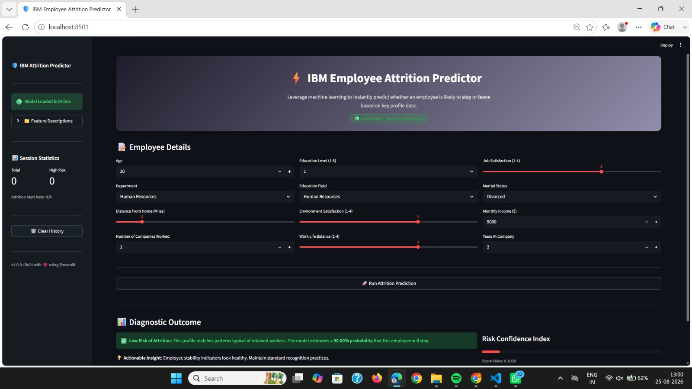

# 🛡️ IBM Employee Attrition Predictor

> An end-to-end machine learning web application designed to evaluate employee turnover risk in real-time, providing instant predictions alongside interactive session analytics and risk factor insights.
> 
> 

---

## 🚀 Project Overview / Description

* **What the project does:** The IBM Employee Attrition Predictor is an end-to-end machine learning application built with Streamlit. It analyzes employee profile parameters—such as age, monthly income, job satisfaction, distance from home, and work-life balance—processes them through a trained classification model, and instantly outputs whether an employee is at high risk of leaving or staying, along with confidence score metrics.


* **The problem it solves:** Employee turnover is costly and disruptive for organizations. Traditional retention management is often reactive rather than proactive. This application automates turnover risk identification, allowing human resources and managers to spot potential flight risks early and take targeted retention actions.
* **Primary use case:** Designed for HR professionals, people analytics teams, and organizational leaders as a decision-support dashboard to monitor employee engagement stability and evaluate individual attrition risks.

---

## ✨ Key Features

* **Interactive Streamlit Interface:** A sleek, responsive dashboard complete with a custom hero banner, dynamic input sliders, and collapsible feature descriptions.


* **Real-Time Predictive Analytics:** Instant classification powered by a pre-trained machine learning model (`attrition_model.pkl`).


* **Session Tracking & Analytics:** Live tracking of total evaluations performed, high-risk counts, and dynamic attrition alert rates within the session state.


* **Confidence Scoring & Actionable Insights:** Color-coded diagnostic alerts with progress bars and tailored recommendations based on risk outcomes.

## 📸 Application Preview

Here is a look at the interactive web form and instant prediction result display:



(Note: Ensure your screenshot image file is placed inside an assets/ folder in your project directory, or update the path above to match where your image is saved).

---

## 🛠 Tech Stack & Dependencies

* **Programming Language:** Python


* **Web Framework:** Streamlit (for building the user interface and reactive components)


* **Machine Learning Model:** Scikit-Learn (Random Forest / Classification model)


* **Model Artifacts & Serialization:** Pickle (`attrition_model.pkl`, `encoders.pkl`)


* **Data Manipulation & Analysis:** Pandas and NumPy


---

📂 Project Structure

```text
├── app.py                  # Main Streamlit web application script[cite: 1]
├── attrition_model.pkl     # Pre-trained machine learning classification model[cite: 1, 2]
├── encoders.pkl            # Saved label encoders for categorical feature transformation[cite: 1, 2]
├── IBM.csv                 # Source dataset used for model training and analysis[cite: 1, 2]
└── README.md               # Comprehensive project documentation[cite: 1, 2]

```

---

## 📥 Installation & Setup Guide

* **Step 1: Clone the repository**
Clone the project repository to your local machine using your terminal:

```bash
git clone <your-repository-url>
cd employee-attrition-predictor

```

* **Step 2: Set up a virtual environment**
Create and activate a Python virtual environment to manage dependencies locally:
* **On macOS and Linux:**

```bash
python3 -m venv venv
source venv/bin/activate

```

* **On Windows:**

```bash
python -m venv venv
venv\Scripts\activate

```

* **Step 3: Install dependencies**
Install required packages using pip:

```bash
pip install streamlit pandas numpy scikit-learn

```

---

## ▶️ How to Run / Usage

Follow these steps to launch and test the application locally in your browser:

* **Step 1: Navigate to the project directory**
Ensure you are inside the main folder containing `app.py` and the model artifacts.


* **Step 2: Launch the Streamlit application**
Run the following command in your terminal:


```bash
streamlit run app.py

```

* **Step 3: Access the application in your browser**
Streamlit will launch a local server (typically at `http://localhost:8501`). Open this link in your web browser.


* **Step 4: Test the application**
Input the employee parameters (such as Age, Department, Monthly Income, Job Satisfaction, Work-Life Balance, etc.) into the interactive form and click **"Run Attrition Prediction"** to view the diagnostic outcome, risk confidence score, and sidebar session statistics.


---

## 📊 Model & Data Details

* **Dataset Overview:** The underlying data source (`IBM.csv`) contains **1,470 employee records** across **13 features**, capturing demographic details, job satisfaction metrics, and compensation information.


* **Dataset Summary Statistics:**
* **Total Records:** 1,470


* **Attrition Distribution:** ~16.1% Yes (237 employees), ~83.9% No (1,233 employees)


* **Monthly Income:** Mean = $6,502.93 (Range: $1,009 to $19,999)


* **Age:** Mean = 36.9 years (Range: 18 to 60)


* **Years At Company:** Mean = 7.0 years (Range: 0 to 40)


* **Features Collected & Used:**
* `Age`: Age of the employee


* `Department`: Organizational department (e.g., Sales, Research & Development)


* `DistanceFromHome`: Distance from home in miles


* `Education`: Education level ranking (1 to 5)


* `EducationField`: Field of study (e.g., Life Sciences, Medical)


* `EnvironmentSatisfaction`: Working environment satisfaction score (1 to 4)


* `JobSatisfaction`: Job satisfaction score (1 to 4)


* `MaritalStatus`: Marital status category (Single, Married, Divorced)


* `MonthlyIncome`: Monthly salary in USD


* `NumCompaniesWorked`: Total number of prior companies worked for


* `WorkLifeBalance`: Work-life balance rating (1 to 4)


* `YearsAtCompany`: Total years spent at the current company


---

## ⚖️ License

This project is developed for educational and professional portfolio purposes.

## 👤 Author / Acknowledgments

Made with ❤️ as part of Machine Learning Application Development.
